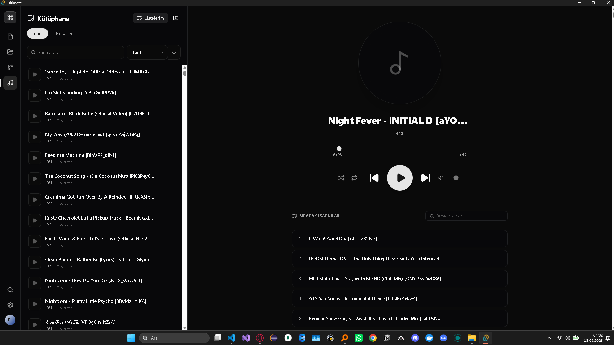
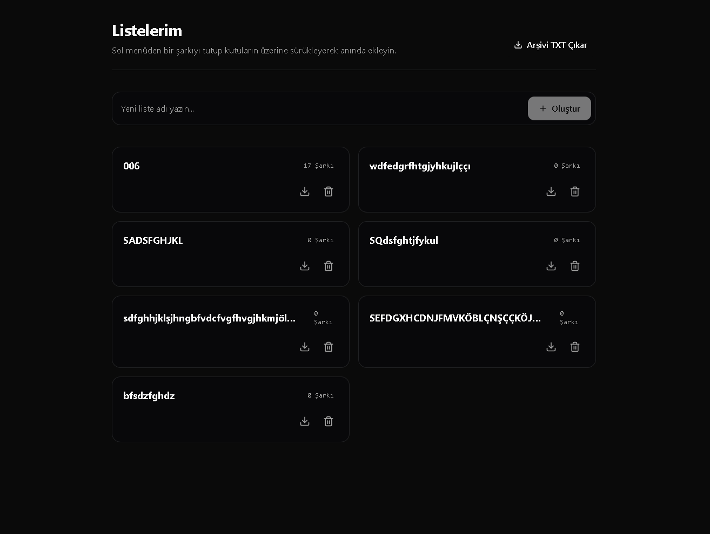
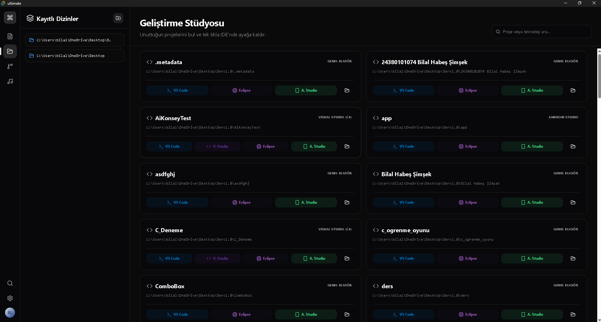
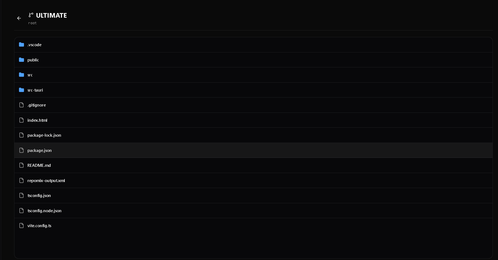
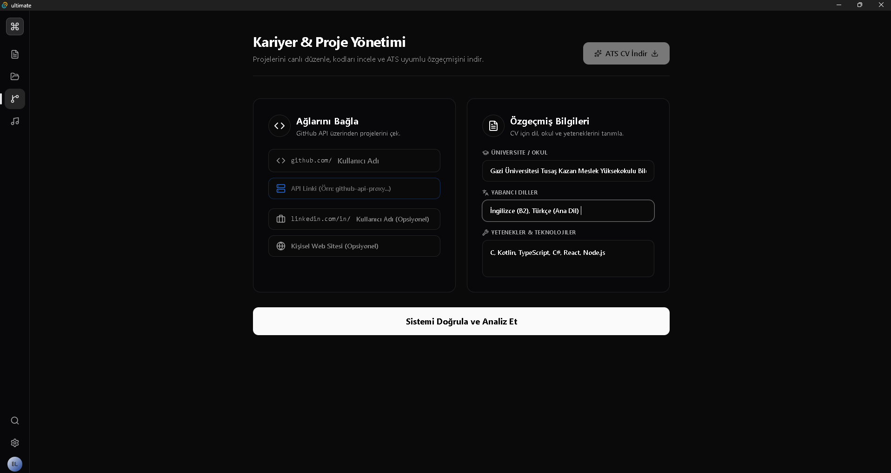
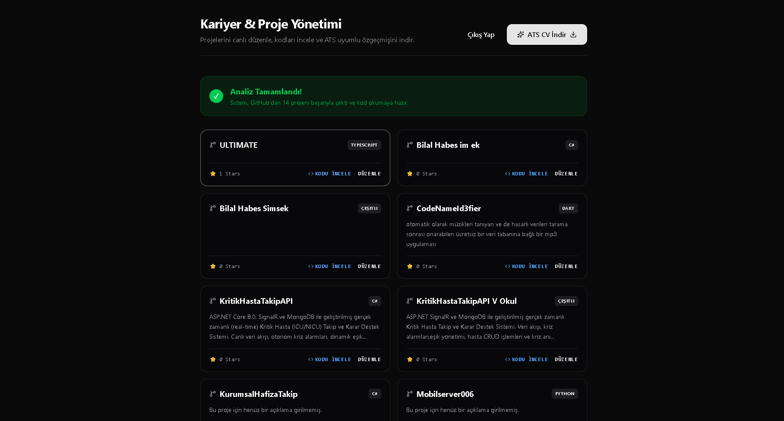
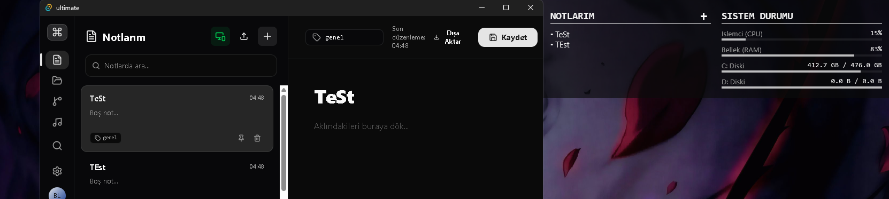

# 🚀 ULTIMATE - Geliştirici Asistanı & Medya İstasyonu


**ULTIMATE**, geliştiricilerin günlük iş akışlarını hızlandırmak ve multimedya ihtiyaçlarını tek bir merkezden yönetmek için tasarlanmış, **Tauri ve Rust** tabanlı yüksek performanslı bir masaüstü (Desktop) uygulamasıdır[cite: 3]. 

Sistem kaynaklarını minimum düzeyde tüketirken; akıllı müzik çalar, proje başlatıcı stüdyo, GitHub destekli ATS CV oluşturucu ve Rainmeter entegreli not defteri modüllerini modern bir arayüzde sunar[cite: 3].

---

## ✨ Temel Modüller ve Özellikler

### 🎵 1. Akıllı Medya Oynatıcı (Player)
* **Kapsamlı Format Desteği:** Klasik ses formatlarının (MP3, WAV, FLAC vb.) yanı sıra `@tonejs/midi` altyapısı sayesinde yerel **MIDI (.mid)** dosyalarını çok sesli sentezleyici (PolySynth) ile çalar[cite: 3].
* **Gelişmiş Kuyruk Yönetimi:** Şarkıları sıraya alma, yukarı/aşağı taşıma, sıranın en üstüne sabitleme (Pin) ve özel listeler (Playlist) oluşturma[cite: 3].
* **Sürükle-Bırak:** Yerel klasörleri tarayıp arşivi oluşturduktan sonra şarkıları sürükleyerek çalma listelerine ekleme[cite: 3].

| Müzik Çalar & Kuyruk Yönetimi | Özel Çalma Listeleri |
| :---: | :---: |
|  |  |
| *MIDI destekli, gelişmiş kuyruk ve oynatma yönetimi sunan entegre müzik çalar.* | *Sürükle-bırak destekli sınırsız oynatma listesi (playlist) ve arşiv txt/dışa aktarım yönetimi.* |

---

### 💻 2. Geliştirme Stüdyosu (Projects)
* **Otomatik Keşif:** Belirlenen ana dizinlerdeki projeleri tarar ve içindeki dosyalara (`package.json`, `pom.xml`, `CMakeLists.txt`, `.sln`) bakarak projenin teknolojisini (React, Java, C++, C#, Python, Android) otomatik tespit eder[cite: 3].
* **Tek Tıkla IDE Başlatma:** Projeleri doğrudan bulundukları dizin üzerinden işletim sistemi komutlarıyla **VS Code, Visual Studio, Eclipse veya Android Studio**'da anında ayağa kaldırır[cite: 3].

| IDE Başlatıcı & Kayıtlı Dizinler | Repo Dosya İnceleyici |
| :---: | :---: |
|  |  |
| *Yerel projeleri otomatik tanıyıp VS Code, Visual Studio ve Android Studio gibi IDE'lerde başlatma ekranı.* | *GitHub depolarını uygulama içinden klasör/dosya ağacıyla anlık olarak inceleme.* |

---

### 📄 3. Kariyer & GitHub Yöneticisi
* **GitHub Entegrasyonu:** Kullanıcı adı ile açık kaynaklı depoları çeker, yıldız sayısına göre sıralar ve depo içeriklerini (kodları) uygulama içinden canlı okutur[cite: 3].
* **ATS Uyumlu CV Üretici:** GitHub verilerini, girilen eğitim ve yetenek setlerini harmanlayarak ATS okuyucularından %100 geçecek saf bir CV oluşturur[cite: 3]. Bu CV, **Markdown (.md) veya TXT** formatlarında dışa aktarılabilir[cite: 3].

| Özgeçmiş & GitHub Bağlantısı | Depo (Repo) Analizi |
| :---: | :---: |
|  |  |
| *ATS uyumlu Markdown/TXT özgeçmiş oluşturmak için okul, dil ve yetenek giriş paneli.* | *Kullanıcının GitHub depolarının canlı analizi ve yıldız sayılarına göre sıralı listesi.* |

---

### 📝 4. Rainmeter Uyumlu Not Defteri
* **Anlık Senkronizasyon:** Alınan notları (Ctrl+S) anında belirtilen bir yerel `.txt` dosyasına yazar[cite: 3]. Bu sayede masaüstündeki **Rainmeter** widget'ları notları anlık olarak ekranda gösterebilir[cite: 3].
* Hızlı etiketleme, sabitleme (Pin), içe/dışa dosya aktarımı ve anlık arama özellikleri[cite: 3].

| Rainmeter Widget & Not Senkronizasyonu |
| :---: |
|  |
| *Uygulama üzerinden alınan notların (Ctrl+S) anlık olarak masaüstündeki özel Rainmeter widget'ına aktarılması.* |

---

## 🛠️ Kullanılan Teknolojiler

* **Backend & Çekirdek:** Rust, Tauri 2.0 API, Native OS Commands (`std::process::Command`)[cite: 3]
* **Frontend:** React 19, TypeScript, Vite[cite: 3]
* **Stil & UI:** Tailwind CSS v4, Lucide React Icons[cite: 3]
* **Ses Motoru:** Web Audio API, Tone.js[cite: 3]

---

## 🚀 Kurulum ve Çalıştırma

Projeyi kendi bilgisayarınızda çalıştırmak veya derlemek için Node.js ve Rust (Cargo) ortamlarının kurulu olması gerekmektedir[cite: 3].

1. Depoyu klonlayın:
   ```bash
   git clone [https://github.com/KullaniciAdin/Ultimate-App.git](https://github.com/KullaniciAdin/Ultimate-App.git)
   cd Ultimate-App
